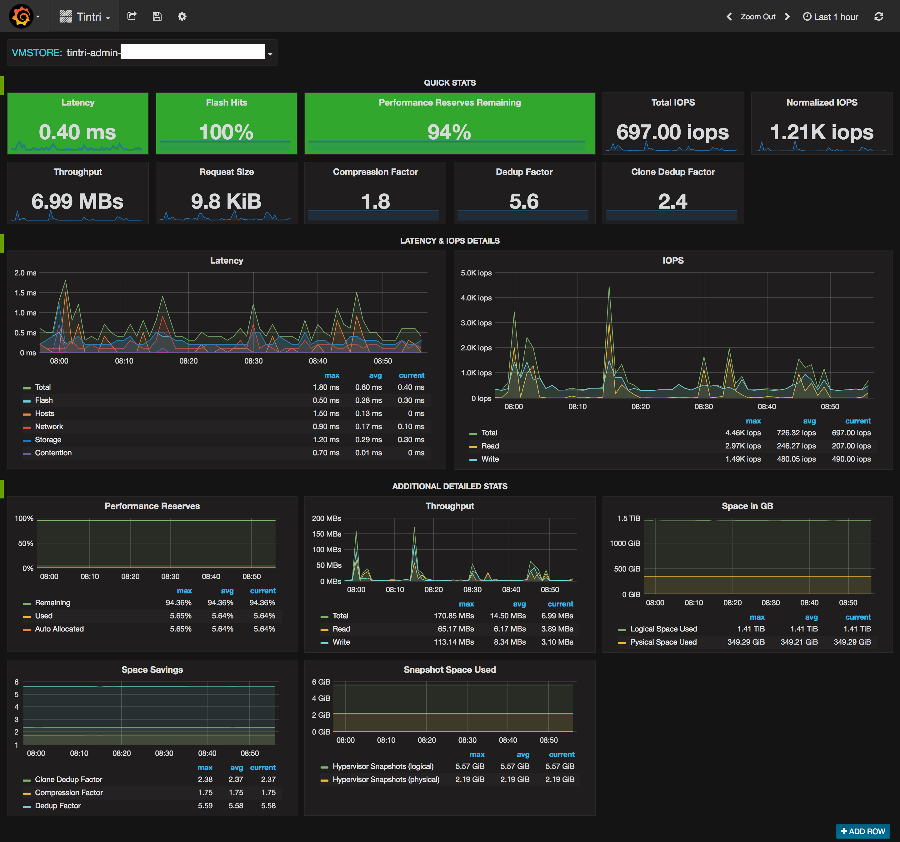

# Tintri Graphite OpenShift

This is a simple app that runs in OpenShift using the
[Python 2.7 template][p27]. It connects to a specified Tintri VMstore, gathers
metrics, and sends them to a specified Graphite server. Optionally, you could
also point this at a Tintri Global Center instance. Keep in mind though that the
data in TGC is not real time. To collect metrics from multiple VMstores you
will need to run multiple instances of this app.



## Usage

If running from OpenShift you will need to set 6 environment variables:

* APP_FILE         = tintri_graphite.py
* vmstore_fqdn     = _the fqdn of your Tintri's admin interface_
* vmstore_username = _a read-only account on your Tintri_
* vmstore_password = _the password for the read-only account_
* graphite_fqdn    = _the fqdn of your Graphite server_
* graphite_port    = 2003 _(adjust if needed)_

If running interactively, you can also pass the last 5 of these as command line
arguments like so:

```bash
read -s vmstore_password
# type / paste your password (it won't be displayed)
python tintri_graphite.py vmstore_fqdn vmstore_username $vmstore_password graphite_fqdn graphite_port
```


## Prior work

This repo contains a modified version of tintri_graphite.py from
[github.com/eric-becker/tintri_graphite][tg-url]
and tintri_1_1.py from [github.com/Tintri/tintri-rest-api][t1-url].


[p27]: https://github.com/sclorg/s2i-python-container
[tg-url]: https://github.com/eric-becker/tintri_graphite/
[t1-url]: https://github.com/Tintri/tintri-rest-api/blob/master/examples/python/
